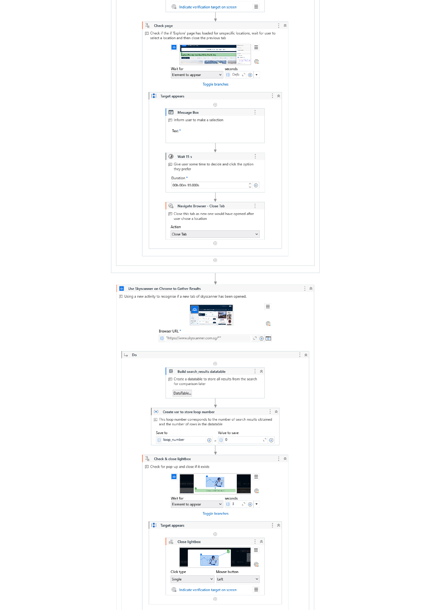
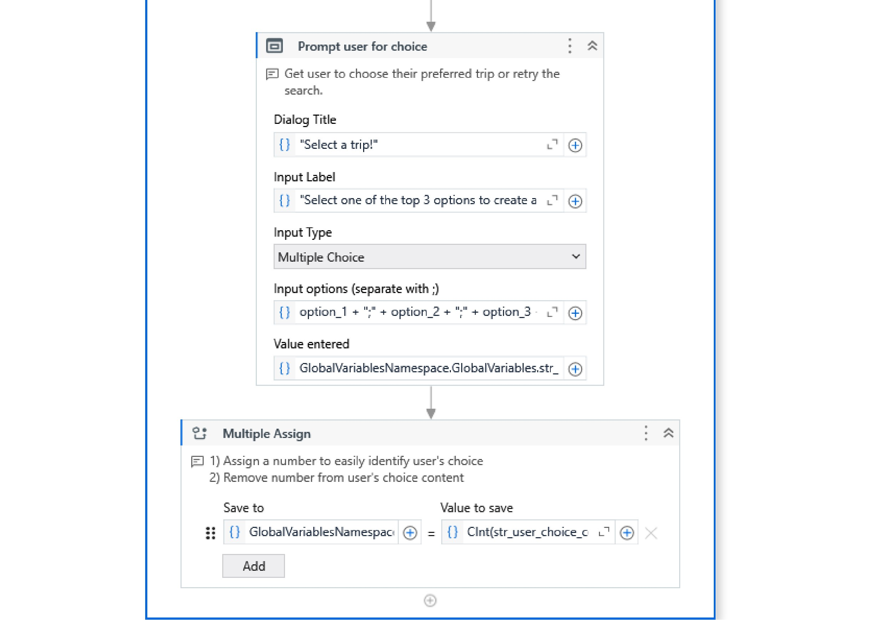

# Flight Checker with UiPath Studio

## Brief Description of the RPA

This RPA application aims to streamline the time-consuming task of searching for affordable flights across various dates. It is especially useful for flexible travellers who are open to different combinations of travel dates. 

The application features a custom HTML form that prompts the user for details about their intended travel. Input validation is primarily handled at the HTML level to ensure precise and accurate data entry so as to minimize errors and ensure the RPA runs smoothly.

Next, using Google Chrome, the application navigates to skyscanner.com.sg to search for flights. According to the user’s selected preference, the top result under the best, cheapest or fastest categories are extracted for every date or date combination in their stated travel period. The top 3 most affordable results are saved in an array. 

After the search across all specified dates is completed, the RPA prompts the user to select their preferred flight. However, if they are not satisfied with the results, they will be re-directed to the HTML form, now pre-filled, change their input and run the search again. Otherwise, the selected trip’s details are entered into chatgpt.com via Chrome and a detailed itinerary is requested, to add value to the traveller’s experience by giving them inspiration. 

The top 3 flight results and the AI generated itinerary are compiled in a Word document and saved as a PDF file. The RPA concludes by opening the PDF file for the user to view the results of their search and the itinerary.

This RPA is ideal for personal travellers, travel agencies and anyone looking to save some time while searching for flights and planning their trip. 

## Workflow Design

### Main Sequence

### HTML Form

### Use Browser Sequence

## Description of Functionalities

#### HTML_Form.xaml

This workflow uses a flowchart. Essentially, it presents the user with a HTML form that is split into 3 parts. All fields are marked as “Required” in HTML, and triggers a warning if left blank.

The first form collects the user’s preferred ‘From’ & ‘To’ locations, and their choice to check for one-way or round-trip flights. Based on this choice, users are presented with the corresponding version of the next form. The RPA saves their input as a single string and splits it into individual variables. 

The next form collects the period of dates (start date to end date) that the user wants the RPA to check. For round trips, the user must specify the trip duration (number of days). Validation is handled in Ui Path, ensuring correct date format, valid dates and that the end date is at least 2 days after the start date. If the validation fails, a warning is shown, and the user will need to refill the form. Upon success, they are presented with the final form.

The last form collects preferences for direct flights, cabin class, number of travellers and the type of result they wish to view (“Best”,”Cheapest”,”Fastest”). Ui Path validates the number of travellers, displaying a warning if it’s an invalid entry.

#### Flight_Search.xaml

This file runs UI automation activities on skyscanner.com using Google Chrome. It fills the flight search form with the user’s input and then scraps results for each combination of dates. 

In the first sequence, a nested flowchart checks if the “From” and “To” fields are empty, before filling them. Then, the RPA navigates the pop-up calendar to select one-way or round-trip. Next, it uses a nested flowchart to verify the month, select the departure date (start date), and return date (start date + trip duration) for a round-trip. The RPA proceeds to set the user’s preferences for direct flights, cabin class and number of  travellers before clicking the “Search” button.

In a loop, the second sequence verifies if the results page has loaded and if flights are available. If found, the top non-sponsored result is scraped. Process_Data.xaml is invoked to use string manipulation to sort the retrieved data into individual elements in an array, that is later stored in a datatable. If no flights are available, the RPA navigates to the next date. The loop continues until the search reaches the end date.

After the search, if the datatable is empty, the user is notified, and the form is presented again to retry the search. If the datatable is populated, the results are written to an Excel sheet for the user’s reference. This is saved within the project folder.

#### Main_Flowchart.xaml

This is the main workflow. It uses a flowchart to invoke other workflows and manage the program’s flow. After running HTML_Form.xaml and Flight_Search.xaml, it checks if a search retry is required based on the availability of results in the datatable. If no retry is needed, the datatable is sorted by the price of the trips and only the top 3 options are kept. These are presented to the user in an input dialog box, along with a 4th option to restart the search if they are unsatisfied with the results. If the user selects a trip, the RPA moves into the next workflow.

#### Generate_Itinerary.xaml

This workflow selects a prompt based on the user’s choice of one-way or round-trip and fills it with the chosen trip’s details. It then connects to ChatGPT via GenAi to generate a travel plan for the selected dates.

#### Output_Results.xaml

This workflow works uses a Word template stored in the project folder. It replaces text placeholders with the user’s search parameters and the top 3 results, each with a hyperlink to its webpage. It appends the generated travel plan to the end of the document and then, saves the document as a .docx and PDF, both named with the current date and time.

## Performance Assessment - Manual vs Automated

A manual flight search might require repeatedly entering details, waiting for results, and manually recording prices. This is a time-consuming process and prone to errors. Typos and missing filters/selections can further delay the process. Checking flights across multiple dates often involves switching tabs and taking notes while planning an itinerary requires extensive research, especially if a traveller doesn’t know where to start. 

In contrast, the RPA can complete the search and generate a basic itinerary within minutes, eliminating typos and ensuring that all necessary filters are applied. It automatically compares the results and presents the top 3. This contributes to its scalability as it can work through a wide 	range of dates much faster than a human.

In conclusion, the RPA is quicker, more accurate, reuseable and scalable compared to a manual search.

## Challenges

#### Working with HTML & CSS Restrictions in UiPath

One of the first challenges I encountered was learning to work within the limitations of HTML & CSS in UiPath. Unlike traditional web development, certain features, like Flexbox, did not function properly within UiPath’s HTML forms. After completing the coding for the forms, I ran them on UiPath but realized that many elements did not behave as I had intended. This required simplifying the code and troubleshooting. In hindsight, I should have started with basic HTML structure and tested its functionality within UiPath before implementing more complex styles and layouts. I could have saved a lot of time.

#### Understanding and Using UI Selectors

Another significant challenge was working with selectors for UI automation activities. Although this topic was briefly covered in class, the UiPath academy course provided a much deeper understanding, which was extremely helpful during my project. When automating interactions with skyscanner.com, knowing how to use the Ui Explorer was essential in being able to analyse UI elements and their attributes. Understanding how the different selectors worked and how to validate targets & anchors, was crucial for ensuring the bot correctly identified and interacted with web elements.

#### Debugging and Handling Dynamic UI Elements

Debugging was particularly challenging due to the unpredictable behaviour of the website. Since I was not comfortably familiar with skyscanner.com, I had to conduct multiple test runs to understand how the UI changed during different flight searches. This included dealing with pop-ups, managing unspecific search locations that required extra user input and scenarios where no flights were available. By leveraging selectors and their attributes, I was able to develop solutions for each scenario, ensuring the bot would run smoothly despite uncommon UI changes.

## Conclusion

This RPA simplifies flight searches and travel planning by automating the process, reducing errors, and significantly improving efficiency. UI automation and AI integration  eliminate the need for manual data entry, ensure accurate filtering, and quickly present the best flight options. The program’s ability to handle multiple date combinations, validate inputs, and generate a travel plan makes it highly scalable and reusable.

Compared to a manual search, this RPA greatly reduces the time required to check flights and enhances the overall travel planning experience. With its structured workflow and automated decision-making, it is the ideal tool for flexible travellers, travel agencies, and anyone looking to save time while planning their trips.

## Screenshots

#### Main_Flowchart.xaml

#### Welcome Message

#### HTML_Form.xaml

#### trip_details_A.html

#### trip_details_B_o.html for One-Way Trip

#### trip_details_B_r.html for Round Trip

#### Examples of Input Validation

#### trip_details_C.html

#### Flight_Search.xaml

#### Input dialog with top results & retry option

#### Sort & display results in Main_Flowchart.xaml

#### Generate_Itinerary.xaml

#### Output_Results.xaml

#### Final Sequence in Main_Flowchart.xaml

## Results

#### Word Document Template for Itinerary

[View Itinerary Template](Resources/Flight%20Inquiry%20Details.docx)

#### Sample Results
[View Sample Results](Results)

